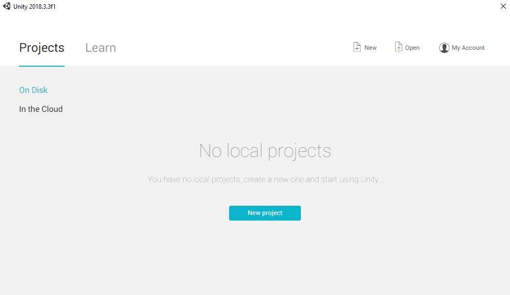
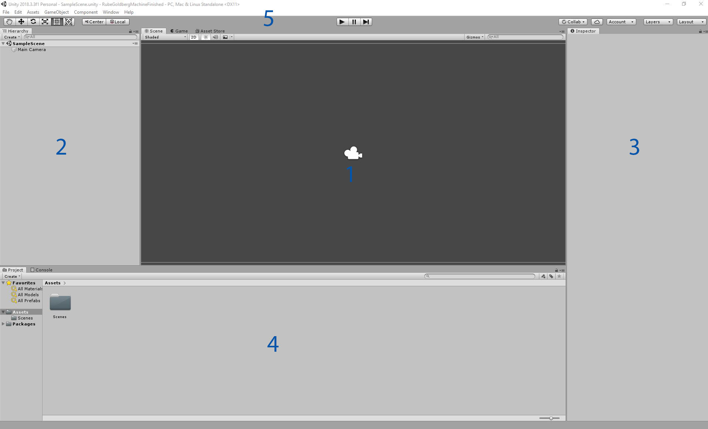

# Rube Goldberg Machine

This is explaining the layout of Unitys' Launcher and Editor layout.

## The Launcher

Before we can dive right into making a game we need to get a project set up in Unity.\
So start by opening Unity.

  

Go ahead and click the "New project" button in the middle.

  

* Give your project a name! (If you are are using this in a class make sure to include YOUR name in the name).  
* Then make sure to set "Template" to "2D".
* And finally choose the location. You probably want to have one main folder to hold all of the projects in these lessons.
*Don't worry about the bottom bit about organizations or analytics. If they have default settings just leave them alone.*  
Now press "Create project" and let it load.  

## The Editor

Now lets point out some of the main features and important parts of the Unity Editor. Don't worry if you don't know what a term means, everything will be explained.

  

1. This is the "Scene View". Here you will be able to navigate your "Scene" and build your levels. It's also where you will see your game when you play it.
1. This is the "Hierarchy". All of the "Objects" in your scene view will be listed here.
1. This is the "Inspector". When you click on an object in the hierarchy or scene view the details will come up here. It's basically a list of settings for what ever you selected.
1. This is the current "Project". All of the files you will use or make for your game will be stored here. 
1. Along the top we have a few things.
	* On the left there is the "Tool bar". These let you move, rotate, and scale objects. We'll talk more about these in the future.
	* In the middle we have the "Play Button". These three buttons let you play and play the game.
	* On the right we have a few settings. 
		* The first three have to do with projects involving multiple people. We will leave these alone for now.
		* Next we have the "Layers". Layers let us have objects only interact with certain layers.
		* The last is the "Layout" this changes where the different windows are positioned in Unity. Feel free to change this to something you like better. If you do change this you might have a tougher time following along. Make sure you know which window is which!
