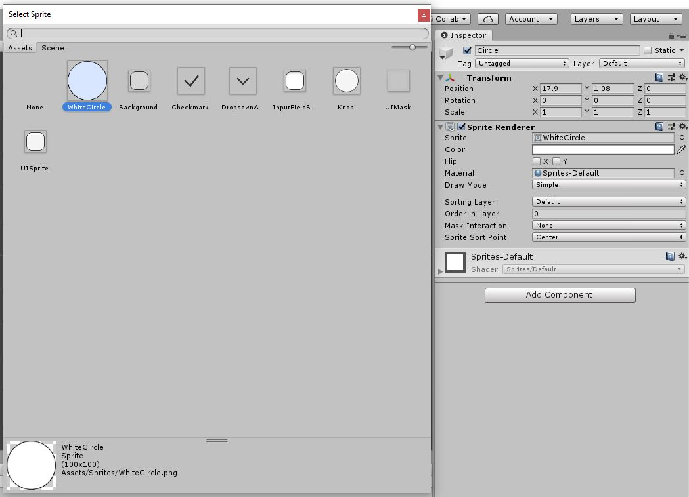

# Rube Goldberg Machine

This is explaining the concept and implementation of "Game Objects" in Unity.

## Game Objects

A Game Object is really anything you put into your game. Everytime you see a character, camera, or piece of the land it is a Game Object. Game Objects hold a list of "Components" that act as it's settings and behaviours. 

### Creating A Game Object

Let's put a Game Object into our "Scene".

Move your mouse over the "Hierarchy" on the left of your screen, right click, hover over "2D Game Object", and finally Click "Sprite".
You will now see that there is a "New Sprite" object underneath the "Main Camera".
Right click this and select "Rename" and give it a name like "Circle". We need to keep our objects named well otherwise it becomes very confusing to fix issues when there are tons of objects.
We cannot yet see this Object in the Scene. Let's fix this quick.
Click on the "New Sprite" object and look at the "Inspector" on the right side of the screen.

What we need to do to make our object visible is :

1. We need to move the object so that it is not in the center of the scene and being blocked by the "Main Camera" Object. We do this by changing the "Transform" of the Object.
	* In the top section "Transform" find the set of three numbers beside position" and set these to "2", "2", and "0" respectively (You can also see this in the photo below).
	* (You can also select the "Move Tool" in the top left of Unity and drag the green and red handles that appear).

1. Next we need to give this object a "Sprite" or picture to actually appear as when we look at it. We do this by giving the "Sprite Renderer" a "Sprite".

	* On the right side on the screen under the "Inspector" find the "Sprite Renderer".
	* The top setting here should be "Sprite", look to right at the bar that says "None (Sprite)". Just at the right edge there is a small circle. Click this.
	* A menu like the one shown above will appear. These are all of the Sprites in your project. For now we just have the default ones. Go ahead and select "Knob". (Later in this project we will add our own sprites.)

	

1. Now you can see the circle in the Scene View though it's very small. Let's fix this. 
	* In the "Inspector" find the Transform again.
	* This time we want to find the "Scale" property. This controls the scale of the object, unsprisingly. 
	* Now set the three numbers to "5", "5", and "1" respectively. See below.

Our circle shoud be now be clearly visible in our Scene.

*A Note*
* You can use the various "Gizmos" in the top left corner to manipulate your objects. Try clicking on any of them ("Move", "Rotate", "Scale") and use the arrows / lines that appear with in the Scene View to change the respective parameter on the object.

