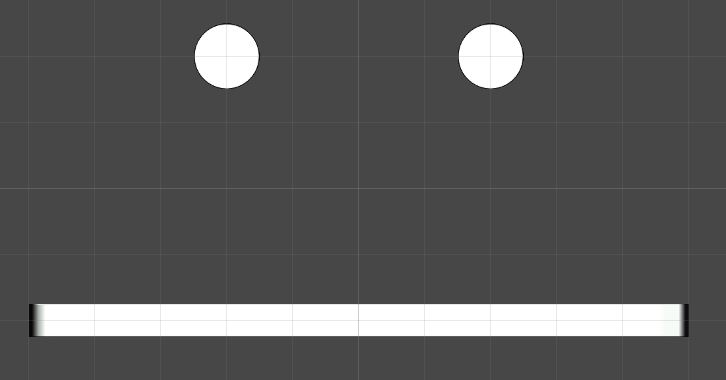
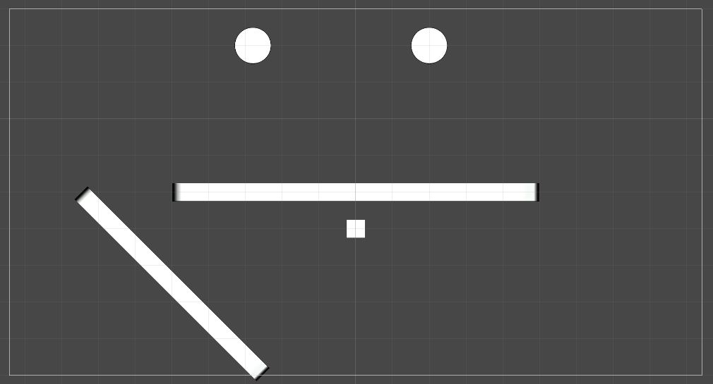

# Rube Goldberg Machine

Here we will talk more about the Rigidbody and Physics in Unity.

## Rigidbody

In the last lesson we added a Rigidbody to our circle and saw it fall. Let's talk a bit more about how this Rigidbody works.\
The basic idea behind the Rigidbody is that it gives an object a physical presence in the world. Just like how you have mass and therefore are affected by gravity. If you didn't have mass you wouldn't be affected by gravity.\
There are many other things the Rigidbody, such as apply drag to objects, but we are just using the basics of the component for this project.

## Collisions

Collisions are one of the most important part of making your game work so let's get some going.\
First thing we are going to do is disable the Camera "Gizmo" so we can better see our scene.

### Colliders

In order for our objects to collide we need to give a Collider. This allows an object to collide or hit other collider Objects.\
Colliders are added to an Object the exact same way as Rigidbody. This is because a Collider is yet another Component.\
Click on our first Circle Object and click add component and begin typing "Collider" until "Circle Collider 2D" shows up. Click on it.

	

*Note, keen eyes might've noticed my Inspector looks different. I've simply collapsed the components to reduce visual clutter. Click the grey arrow in the top left corner of the component.*	

You will now see there is a green circle within your circle. This is what the Collider considers its edge.\
Since this green circle is too small we need to change the size of the it. You can click on the "Edit Collider" button and drag the green squares to change it or in this case set the Radius to "0.5".\
You can tell if the collider is the right size by simply seeing if the size of the green circle is close to the size of the white circle.
In order for us to see the Collider in action we need something else to collide with. 

* Add a new Sprite to your scene.
* Give it a name like "Ground". 
* Set it's position to "0, -2, 0".
* Set it's Scale to "10, 0.5, 1".
* Add the "WhiteBox" file from the Assets folder to the Sprites folder in the Project.
* Set the Sprite to the "WhiteBox" sprite.
* Add a "Rigidbody 2D" to it.
* Add a "Box Collider 2D". This should be the proper size, but you can change it if not.

It should look like this :

Now run your game!\
Oh hold on, that was kinda lame. The box fell too. What good is ground if it falls?\
Let's fix this quick. We just need to change the boxs Rigidbody "Body Type" from "Dynamic" to "Static".\
The "Body Type" tells Unity how to compute the physics of the Object. In our case Dynamic means the Object is affected by physics and Static means the Object is present in the "Physics Space" but not changed by interactions.

Let's run the game again.\
Ok still kinda lame, but we're getting better!\
Let's try one more thing.

* Click on your box and duplicate it.
* Rename it to something like "Anchor".
* Set the Y Position to "-3".
* Finally set the first Boxs' (The big one on top) Body Type back to Dynamic.

Now run it!\
We're cooking with gas now!\
There's just a few more things we're going to do to make this a bit more interesting.\
I encourage you to try setting up the world on your own now. Based on the picture below try and do this yourself. Don't worry about exact values, just see if you can make something similar.

If you can't get this setup just click below for the cheat sheet. But do try it on your own first!

Scene Setup Help

 

* Add a Circle Collider 2D and Rigidbody to the second circle. Just like on the first one.
* Shift the second circle a little to the left.
* Create a second Box with a Rigidbody set to Static and a box collider.
* Set that boxs Position to "-5, -4.5", the Rotations Z to "-45" and the Scale to "7, 0.5, 1".

These numbers don't need to be exact and you can change around the Scene to your liking. Feel free to play around with this. You will be able to understand this better if you do this yourself.

## Physics

Unity has a built in physics engine to make all of your game objects behave realistically. Rigidbodies and Colliders are key parts of the physics in Unity but don't strictly need to be affected by the physics.\
We're now going to talk about how you can change the way physics behave by using Physics Materials.

### Physics Materials

In Unity we can give our Rigidbody a Material. These affect the way physics are calculated on our Objects. We can change the bounciness and friction of our elements.\
There are other things we can do but these are the most basic and useful to use.\
*Just a note, Physics Material and Material are different things but I will be refering to Physics Material here.*

We need to make a Material first. We are going to up hold our current organization and start by making a new folder in our Project call it "Physics Materials". Just like we did before with the Sprites.

	

Navigate into that folder, right click, and then find and click on "Physics Material 2D".\
Now name that Material "Bouncy".

	

Go and click on the new Material. If you look over at the Inspector I bet you can guess what we are going to change.\
That's right! Set the "Bounciness" property to 1. It can be whatever you'd like but it's best not to go too high.\
When we change the "Bounciness" of a material we increase or decrease the amount of energy retained after each collision.

Go and put that Material, Bouncy, onto our first circle.\
Click onto the Circle and then into its RigidBody. Click the setting named "Material", and choose our new Material.

	

If you play the game now you will notice the first circle bounces much higher.\
Go ahead and play with that value until you find something you like.

The other property on the the Physics Material 2D is Friction.\
The idea behind Friction is the same as the real world but the execution in Unity is a bit different.\
Unity's friction is calculated based on the number of points of contact between two objects. Meaning that a circle isn't really affected by friction as technically there's only ever one point of contact.

Below is is the effect in action. I've colored the high friction slope to be red for you.

If you'd like to get a feel for this yourself go ahead and set this up.\
You can do it right beside what's already there in your project. You may need to move the camera though.\
If you are having trouble with this click below for some more details. It's highly encouraged that you try and set this up on your own first.

	

Setup to test friction

 

*All the numbers used here are just suggestions. Go ahead and change it up to what you want.*

First we have to make our Physics Material for friction. 
* Make a new "Physics Material 2D" in the "Physics Materials" folder and name it "HighFriction".
* Click on the Material and set the "Friction" property to "2".

Then we need to set up our ramps.

* Start by making a new sprite, set its sprite to "WhiteBox", set it's scale in the X to "5", and rotate it in the Z axis to about "20". Name it something like "FrictionRamp".
* Give the sprite a "Rigidbody 2D" and "Box Collider 2D" component. Make sure the Rigidbody is set to "Static".
* Duplicate the Ramp and move the new one out of the way of the old one. Rename the new one to "FrictionRamp2".
* Give one of the ramps the "HighFriction" material.

And then our Boxes.

* Create a new sprite and set its sprite to "WhiteBox". Name it "Box1" or similar.
* Give the sprite a "Rigidbody 2D" and "Box Collider 2D" component.
* Position this Box a little above one of the ramps. Duplicate it, rename it, and move it onto the other ramp.

The setup does not need to be exact. Feel free to play around with this and make this to your liking. The result should be similar when you press play.\
You'll notice the Box that is going down the high friction ramp is sticking much more.

