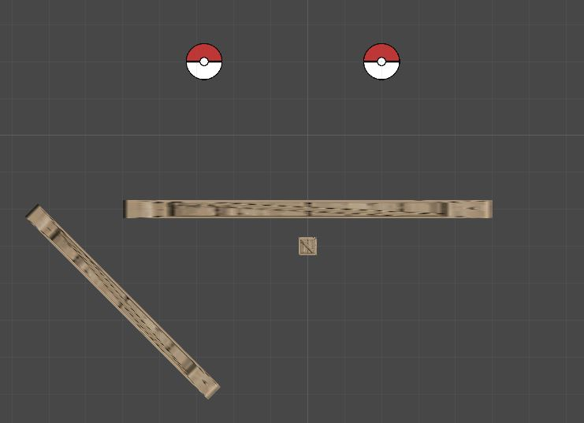
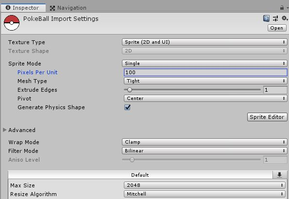
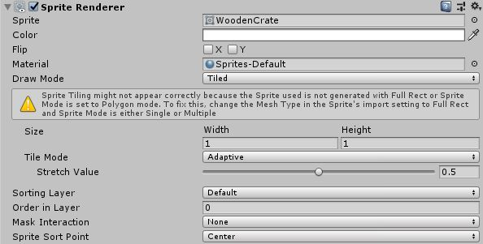

# Rube Goldberg Machine

The last section we are going to talk about are Sprites. You might've noticed that we've already been using these in the form of our "WhiteCircle" and "WhiteBox", which is correct. There's a lot more to Sprites than this, more than we could cover now.\
For now, we will just go over putting your own sprites into the game using them in a few ways.

## Sprites

You might be wondering why we've called our images "Sprites". Sprite is simply the common name used for a 2D Graphic used in a game.\
The origin of the name is that Sprite is another word for a ghost. In our game the Sprites float on top of our background like they are ghosts.\
Just an interesting fact for you.

### Importing Sprites

Before we can use a sprite we need to actually put it into our game. We're going to do the same thing we did with the "WhiteBox" and "WhiteCircle" but this time I'm going to let you choose the Sprite.

For this let's get three different Sprites.\
We are going to need :
* A background.
* A ground / box.
* And a circular object.

To find these you can simply google "Video game sprites ______" and insert what you want. Sometimes you might need to play with the wording lots to find the right one or a few that work well together.\
You will likely need these to be PNG files otherwise they might look very odd or cut off parts of the game.\
If you are an artist, don't worry. There will be better opportunities later to make your own Sprites.\
Here are the ones I found :

  
   
  

After you have these three sprites go ahead and import them into Unity as we did in the [Game Objects Lesson](/2%20GameObjects.md). Refer back to that if you need a refresher.\
Once you've got those in the file we are going to use them in place of the circle and box we've been using.\
After that your game should be looking a little more custom like so :

Parts of mine look okay but the ramps look very stretched. It's likely your sprites look bigger or smaller than they should also.\
This would be mainly cause by the size of image. The grid shown in Unitys Scene is 100 by 100 pixels. If your image is larger or smaller than this it will appear distorted.\
An easy way to fix this is to scale the image to 100 by 100 in photoshop or we can do it within Unity.\
If you want to use the built in features this is how :

* Click on your Sprite, the one in the folders, not the Hierarchy. Then click on "Pixels Per Unit" in the Inspector.
* Set the value of this to the same as your images size (Works best if the image is square).

You can play with that value until it works if needed. Don't worry we can always make things work, it just might mean later on you'll need to pay more attention to something like the size of your Colliders.\
In the future when working with Sprites made by you or an artist it is a good idea to follow one scale for all. Meaning if two sprites are supposed to be the same size make them the same pixel size.

Now that we've got that working we will still need to fix the ramps as they are very stretched.\
Again there are a few ways to do this. We can Tile sprites or use 9-Slicing.\
I will demonstrate both and it is up to you to decide which is best in your senacario.

### Tiling

Tiling sprites means that our sprites repeat rather than stretch when it reaches it's max size. Like a repeating pattern of bricks.

The first thing we need to do is set our sprite to be a tiled sprite. Click on the Object you'd like to edit and find its "Sprite Renderer" in the Inspector.\
Find the "Draw Mode" property and set it to "Tiled".

This will bring up an expanded menu below.\
Right now I'd like you to stop for a minute and simply play with the new "Width" and "Height" values. You can also use the "Rect Tool" in the top left of the screen and drag the blue balls that appear around the Object.\
As you may notice the values of this "Width" and "Height" denote how big a sprite should be before it tiles.\
It is important to note that these values are based on the Scale values in the Transform of an object.\
Typically in Unity it is a good idea to leave the scale at "1, 1, 1" when possible simply because this makes them easier to work with in the future.

For now I will do this with a scale of "1, 1, 1". This means we'll need to manually adjust the size of the box collider and sprite.

* Start by setting our scale back to "1, 1, 1".
* Then on the "Sprite Renderer" set the "Width" to "10" and the "Height" to "0.5". 

	

*Note this does squish our sprite vertically. For me it looks ok but if yours does not set it to something that does. If you do just be careful while working with the colliders size.*

Now go to the "Box Collider 2D".

* Click the "Edit Collider" button. This is just to see the size of the collider easier.
* You can drag the green squares that apear in the scene view if you'd like but I will use the "Size" settings to be percise.
* On the "Size" Property set the values of "X", and "Y" to "10", and "0.5" respectively.

	

Make sure those values work for the size of your sprite. Check this by seeing if the green outline of the Collider matches the sprite.

If you run the game you should see it works just as before but now it looks nicer.\
Now let's try out the other technique and see which is better for your sprites.

### 9-Slicing

### Backgrounds With Sprites

Now let's get the background in here. We are just going to do a simple but effective way to make this.\
Start by making a new Sprite, like we've done before, and name it "Background."
