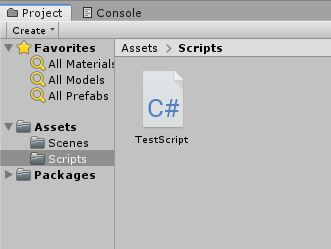

# Dice Game

Here we are going to figure out what a Script is and how Unity uses them.

## Scripts

Scripts are what we call our code. Our scripts are simply written files that follow specific rules and can be interpreted by our computer.\
Scripts in Unity are treated as other Components like a Rigidbody. You can attach them to any Object and they are written using the Language of C#.

[C#](https://docs.microsoft.com/en-us/dotnet/csharp/) is a programming language made by Microsoft and is Object Oriented language.\
We will get more into what this means later.

There is a lot to code. But I think a good way to start is to simply jump into it. Don't worry if not everything makes sense the first time around. Just make sure to try everything and the best advice I can give is to play around with it. Try and do something unique.

### Adding Scripts In Unity

Start by making a new Unity project. Make the project 2D, though for this project that doesn't really matter.

As stated before, Scripts are just another type of component. Let's start by making a new Folder in our Assets and call it "Scripts".\
Go into that folder and right click, create, and click "C# Script". Give this script a name like "TestScript". 



Open that up. I'm making this project with Windows and the default Code Editor with Unity, [Visual Studio](https://visualstudio.microsoft.com/).\
If you are on a different system this may be different. No worries it's all the same you just might need to search for a button a little more.\
The script should look like this :

```csharp
using UnityEngine;
using System.Collections;

public class TestScript : MonoBehaviour {

	// Use this for initialization
	void Start() {
	
	}
	
	// Update is called once per frame
	void Update() {
	
	}
}
```

What you see here and on your screen is the default script generated by Unity.\
Let's disect this a bit.

#### Comments

The very first thing to mention are [comments](https://www.c-sharpcorner.com/UploadFile/puranindia/comments-in-C-Sharp/). the lines that start with `//` are "commented out".\
This means that the computer will not read the line. You can put whatever you want here.\
A very common use for comments are adding notes to your code so that others can quickly understand what your code does.\
They can also be written :

```csharp
/*
	This is commented out.
	And so is this.
	And on...
*/
```

#### Using

Right at the top we see `using UnityEngine;` and `using System.Collections;`. These ["Import"](https://docs.microsoft.com/en-us/dotnet/csharp/language-reference/keywords/using-directive) code to our script so that we can attach our script to the game or use code written by others. There's a little more to it than that but we can get to that later. Typically don't remove these two unless you know you don't need them but later we will add more of them.

#### Classes

Just below that we have `public class TestScript : MonoBehaviour` which creates a [class](https://docs.microsoft.com/en-us/dotnet/csharp/tour-of-csharp/classes-and-objects).\
Classes allow us to create multiple objects with all the same features. Quite similar to the Game Objects we've been using.\
An example I like to think of is a car. A car has wheels, an engine, and a steering wheel but each car can have different wheels, engines, and steering wheels.\
Instead of saying what a car is a bunch of times I can simply make `class Car` that contains things like the type of engine, the color, the ability to speed up.\
Then whenever I want to make a new car I can use this predefined `class` to speed up thaat process.\
Classes are blueprints that can build off of each other. In this case `TestScript` inherits from ["MonoBehaviour"](https://docs.unity3d.com/ScriptReference/MonoBehaviour.html), denoted by the `:`, which is a class created by Unity.\
Here we can use all of the functionality that was made in `MonoBehaviour` in a new way.

#### Functions

Then we have `void Start()` and `void Update()`. These are [functions](https://docs.microsoft.com/en-us/dotnet/csharp/programming-guide/classes-and-structs/methods) (in some situations functions are called ["methods"](https://docs.microsoft.com/en-us/dotnet/csharp/programming-guide/classes-and-structs/methods) but they are the same for our case). Functions allow us to write code once then call it lots of times throughout your code.\
The two functions written here are from the `MonoBehaviour` class we talked about above.\
`void` is the [type](https://docs.microsoft.com/en-us/dotnet/csharp/programming-guide/types/) of data the function gives back to us, in this case [nothing]((https://docs.microsoft.com/en-us/dotnet/csharp/language-reference/keywords/void)).

That's quite a bit of info to take in. That might not have all made a bunch of sense but that's ok. There is a good bit to code and especially to start with. It's typically easier once we start writing code to understand these things.\
We also have a file of refrence material with links to videos and tutorials that go a lot more into the explanation if you need that.\
Let's write some code!
