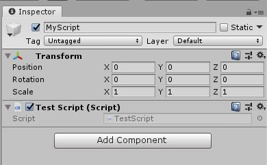

# Dice Game

Here we are going to write our first program.

## Basic Coding

To begin we need to know where to actually write our code.\
In the Editor duh!\
Not exactly we can't just put it anywhere in this file. For this we need to use the `Start()` function.\

Let's just talk a bit more about those functions.\
The `Start` and `Update` functions are inside of the `class TestScript`. How do we tell this? the `{}`!\
You can more or less think of `{}` or curly braces as a container. When we make our `class` we "open" a curly brace, put what we want in the class inside the brace, then "close" the brace.\
So if you look at the code below you'll notice after we "declare" our `class` we have a `{` then at the bottom of the code a `}`. So everything between these two brackets is inside the `class TestScript`.

```
public class TestScript : MonoBehaviour {

	// Use this for initialization
	void Start() {
	
	}
	
	// Update is called once per frame
	void Update() {
	
	}
}
```

This is what is contained within the class `TestScript`. Using this same logic we can apply it to the `Start()` function. Look for the curly braces just after it.

```
	void Start () {
	
	}
```

Since we want to write inside this function we can type it on the line after `void Start() {` but before the `}`.\
Let's type this in `Debug.log("Hello World");`. For now just write this exactly and we'll customize it later.\
The function should look like this :

```
	void Start () {
		Debug.Log("Hello World");
	}
```

*Note my spacing, we'll bring that up later as well.*

Save this script and return to Unity.\
Now we need to put our script into the scene. We do this the same way we put a component on our object.\
Let's just create a new "Empty Object" and give it a name.\
Click onto it and add our script to it. Just like you would with the collider. The name of the component will be the same you gave the script.\
It should look like this after :



Now hover over "Window" along the top bar, go down to "General", and then find and click on "Console". This brings up the Console which is where Unity will type messages for us from errors, code, and the likes.\
With this open, run the game. You should see :


And there you go. You've written code and passed the age old tradition of saying "Hello World".\
Now how did we do this? This might seem like a lot of info but trust me, once you get it all on paper you can break it down easier.\
Let's start small and work upwards.  

What does `Debug.Log("Hello World")` actually do? 
