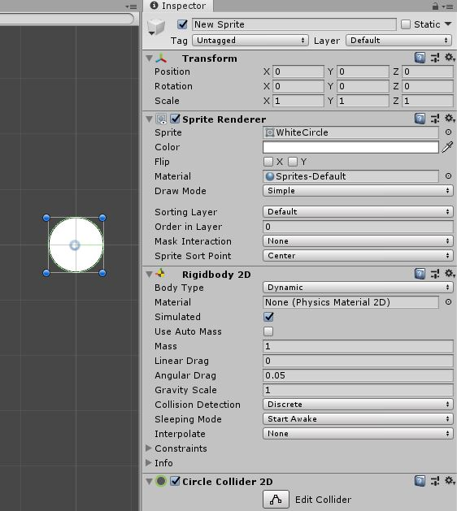
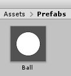
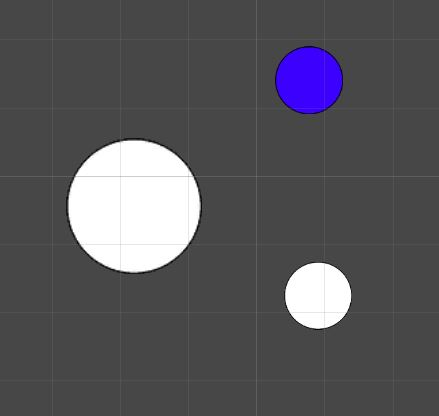
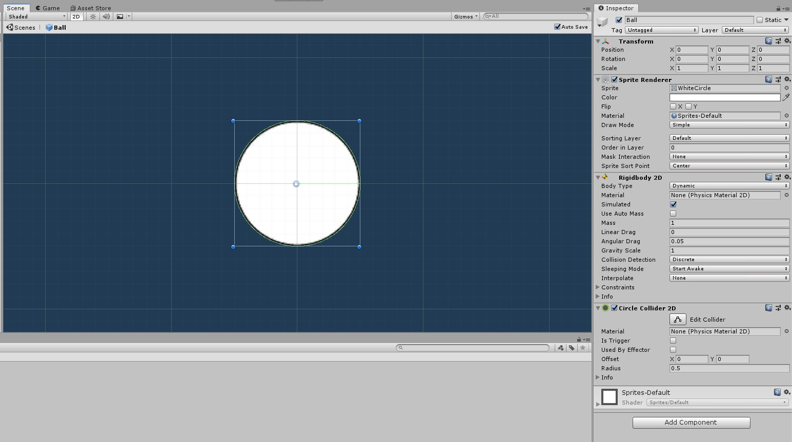
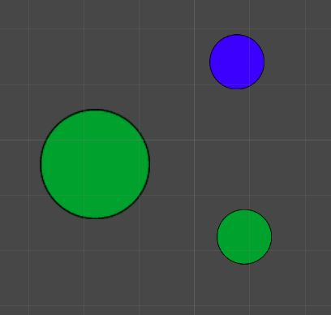
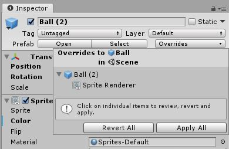
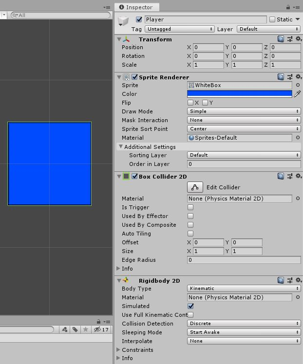

# Top Down Arcade Game

Here we will explore the concept and utilisation of prefabs in Unity.

## What Are Prefabs?

["Prefabs"](https://docs.unity3d.com/Manual/Prefabs.html) are a blueprint or default of an object that we can copy and paste around our game.\
Let's explain it with an example.\
You are adding enemies to your game. This enemy is made of a few parts :

* Enemies have a sprite renderer.
* They have scripts that deal with movement, attacking, and health.
* They have a collider.
* They have a rigidbody.
* And the list goes on.

Now if you were to start adding these enemies you can see how long it will take you. For each enemy you add you will have to add all of these things and also set the values of each component.\
Now enters the prefab.\
You make a single enemy with all the bells and whistles, turn it into a prefab, and then you can place down as many enemy prefabs as you want and all these defaults are already set.

That should illustrate how great prefabs are and also how essential they are.\
So how do we make a prefab?

## How To Make Prefabs

While first we need to create an object that we will make into a prefab. At this point you just need to try and make one, it does not need a purpose in your project here.\
You can put whatever you want onto this object. Perhaps make a "Ball" object that has a sprite (look up a ball sprite online or use the circle from the [Rube Goldberg](../1%20Rube%20GoldBerg%20Machine/Assets/WhiteCircle.png)), a circle collider, and rigidbody 2D.

For best practice, first create a new folder in your project window and name it "Prefabs". Then drag the object into that folder.
Once we have that all set up to our liking all we have to do is drag the object from our hierarchy into our project window, and more specifically with into our prefabs folder.\
It's that easy. You'll now see our object was turned into a prefab inside the folder. Now we can use that in our scene instead of making new objects.

## Using Prefabs

Having prefabs are great but now we need to actually use them. This is very simple. Just drag the prefab from the folder into the scene.\
Go ahead and drag a few onto the scene. When you press play you will notice that they fall because they all have the components we added to the prefab which included a Rigidbody.\
You can also individually edit these objects. Try changing some colors or size on the objects (from the hierarchy), not the prefab (in the folder).

This is great so far but now to show you the real power of prefabs.\
Say we had a thousand of these balls around our scene and all of a sudden we decide that we need to change something on them. Now we need to go through all of them and update them. We'd likely have to go through different levels of our game and try to find them all. If we miss even one it might seriously mess up our game.\
Now if we used Prefabs we can update any number of these balls with a single click.\
Go into the Prefabs folder and double click on the Ball prefab we made. This will open up a window where we can edit just our prefab.

Within here we can edit the prefab itself. So whatever this looks like is what our prefabs will look like when we drag it onto the scene.\
Let's start by setting the color to green. Now we should see the ball as green. Let's go back to the game view we had.\
To do this click on "Scenes" in the top left of the scene view window. It should be beside the name of our prefab. Like this :

Now in our scene it should look something like this :

Not all of our circles are green. What's with that?\
Well if you [look back](#using-prefabs) at the prefabs before we edited the color you'll notice that one of them was blue and two were white. So why did only the white ones change?\
Well that's because those balls had the "default" color of the prefab. If a change is made to a prefab every instance of theat prefab that has the default of value will update.\
Since the we made the one ball blue by hand it's color value was not **not** default and therefore not changed. The color was [overriden](https://docs.unity3d.com/Manual/PrefabInstanceOverrides.html).\
Now try and make one of the green balls red and then go edit the prefab again. Take note of which ones update thier color.

***Note***\
If you'd like to see whether an object has default values or custom values compared to the prefab you can just look at the Inspector. Any value that is not the default will have a bold name like this :

You'll notice the color is in bold and has a blue line on the left of it.\
If you want to reset these values to the default you can click the "Overrides" dropdown just below the name of the object and revert them as you wish.

Go right ahead and play around with these prefabs. There isn't much you can break when there's a reset button!\
It is important to understand how to use prefabs in order to make a quality game so spend some time with them.

## Player Prefab

We are going to create a Player Prefab to use in our game. We won't be able to add everything we need to right now but will build it up throughout this unit.\
Let's start by putting the [white square](../1%20Rube%20GoldBerg%20Machine/Assets/WhiteBox.png) we used in the [Rube GoldBerg](../1%20Rube%20GoldBerg%20Machine) unit into our game.\
Right click on your Hierarchy, scroll down to "2D Object", and create a new "Sprite". Name it "Player".\
Go into the Inspector and set it's sprite to the white box we just added. Just for fun make it blue (or whatever color you want!) using the Color option.\
Next we should add a [Box Collider 2D](https://docs.unity3d.com/Manual/class-BoxCollider2D.html) to our object. Make sure to use the 2D option. If you used the box sprite provided from this course the default size of the collider should be good.\
Next add a [Rigidbody 2D](https://docs.unity3d.com/Manual/class-Rigidbody2D.html). Again, make sure it's 2D. There is one more thing to do here. If you play the game you will notice that the player just falls. To remedy this go onto the Rigidbody component and change "Body Type" from "Dynamic" to "Kinematic". 

Here we are using Kinematic as opposed to Static. This is because we still want to move our player around. Static is used for something like ground because it's never going to move.\
Kinematic allows us to move an object via it's transform. When an object is kinematic the physics engine is not run on it, meaning gravity or something else colliding with the object will **not** make it move. However if a different objects hits the kinematic object the other objects physics will change based on the collision.\
Use Dynamic when an object should have physics, Static when it should never move, and Kinematic when it should only be moved with code.

With that we should be good to make this player into a prefab. Just [drag](#how-to-make-prefabs) it into the prefab folder.

Now we can move on to making some scripts to manipulate that prefab and use input from the player to do so!
