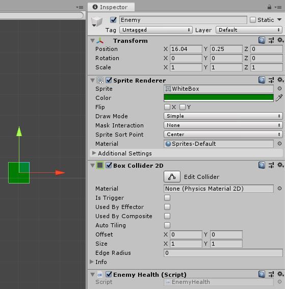

# Top Down Arcade Game

If we are going to be shooting we obviously need a way to detect when the bullet hits something and then react to that.\
This will look into detecting collisions, tracking health, and some basic enemies.

## Collision Detection

We already touched on this briefly in the [last lesson](./2%20PlayerInput.md#deleting-bullets). Let's get into it a bit more here.\
Any object in our game with a [collider](https://docs.unity3d.com/Manual/Collider2D.html) can detect collisions using the ["OnCollisionEnter2D"](https://docs.unity3d.com/ScriptReference/MonoBehaviour.OnCollisionEnter2D.html) function. Here we will only be using 2D colliders.\

To start let's create a new sprite in our scene and name it "Enemy". Give it a sprite and a unique color. It also needs a collider. For now our enemy will just be a target and won't retaliate.\
With that we need to make a new script, let's call it "EnemyHealth". 



Open that up.\
Since we are going to be dealing with the collisions of our enemy we need to use the `OnCollisionEnter2D` function. Add that in just like we did with the bullet.

```csharp
void OnCollisionEnter2D(Collision2D collision) {

	// Collision logic here

}
```

Now when our enemy collides with something this code will run. Obviously it does nothing right now but we can fix that.\
We only want the enemy to react to the bullets currently. Lucky for us we set up a very easy way to detect if we were hit with a bullet in the [last lesson](./2%20PlayerInput.md#deleting-bullets).\
But first we are going to set up the other object in the collision as a variable. This is a good bit to make a habit of.

```csharp
void OnCollisionEnter2D(Collision2D collision) {

	GameObject otherObject = collision.gameObject;

}
```

This will just make our code simpler and look nicer.\
Now check if that object has the tag "BulletTag". For now print out "Hit!" if the enemy was hit with a bullet.

```csharp
void OnCollisionEnter2D(Collision2D collision) {

	GameObject otherObject = collision.gameObject;

	if(otherObject.tag == "BulletTag") {
		Debug.Log("I've been hit!");
	}

}
```

Run the game and you should be able to see that whenever a bullet hits the enemy it will print out that it got hit.\
If you are curious to test this further simply try removing the tag on the bullet prefab and play again.

## Basic Health

With that working correctly we can begin to make this actually track health.\
If you think about any game you've ever played the health is just a number. Perhaps we should store our health with a number then? Make a new `int` called `currentHealth` or similar.\
It's a good idea to make this a `public` variable as so we can quickly change the value and balance the game. Feel free to give it a default value also.

```csharp
public class EnemyHealth : MonoBehaviour {

	public int currentHealth = 5;

```

Instead of printing out "Hit!" let's print out `currentHealth`. Now if we think about this code for a second you might be able to realize that our health does nothing.\
Each time the enemy is hit we simple print out the value of `currentHealth` without changing it. Once we're hit (by a bullet) we need to take away some health. Let's do that.

```csharp
void OnCollisionEnter2D(Collision2D collision) {

	GameObject otherObject = collision.gameObject;

	if(otherObject.tag == "BulletTag") {
		currentHealth--;
		Debug.Log(currentHealth);
	}

}
```

Go and shoot your enemy! The console should look something like this :


It works, but there's a problem. Shouldn't the enemy die when it's health hits zero?\
Why yes! We need to add another `if` statement to check that if we are at or below zero health. If we are, destroy the enemy.

```csharp
void OnCollisionEnter2D(Collision2D collision) {

	GameObject otherObject = collision.gameObject;

	if(otherObject.tag == "BulletTag") {

		currentHealth--;

		if(currentHealth <= 0) {

			Destroy(gameObject);

		}

		Debug.Log(currentHealth);

	}

}
```

Now as you can see, when we shoot the enemy enough they are destroyed! This is all we really need to make a basic health script. A number to keep track of the health and a collision that decrements that health.

// knockback ?? Extras section
// Basic player health via collision
